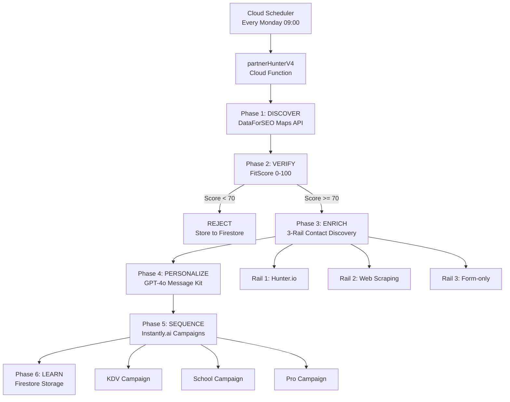

# ADR 0006: Partner Growth Engine v4.0 Architecture

**Status:** Accepted  
**Date:** 2026-02-02  
**Deciders:** Michel Korpershoek, Antigravity AI  
**Tags:** `marketing`, `automation`, `b2b`, `ai`, `architecture`

---

## Context

Bedtijdavonturen.nl needs an automated B2B partnership acquisition system to scale outreach to potential partners (kinderopvang, scholen, professionals). Previous manual outreach was time-consuming and inconsistent.

### Requirements

1. **Quality over Quantity**: Only contact high-fit prospects
2. **Personalization at Scale**: Each email must feel hand-written
3. **Segment-Specific Messaging**: Different approaches for KDV, Schools, Professionals
4. **Deliverability**: Avoid spam, maintain sender reputation
5. **Learning Loop**: Capture data for continuous improvement
6. **Weekly Automation**: Minimal manual intervention

---

## Decision

We will implement a **6-Phase Quality-First Pipeline** for automated partner discovery and outreach:

```
DISCOVER → VERIFY → ENRICH → PERSONALIZE → SEQUENCE → LEARN
```

### Architecture Overview



---

## Detailed Phase Design

### Phase 1: DISCOVER (DataForSEO)

**Responsibility**: Find potential partners via Google Maps data

**Implementation**:
- API: DataForSEO Maps Live Advanced
- Search: 4 cities × 5 keywords = 20 searches
- Cities: Amsterdam, Rotterdam, Utrecht, Den Haag
- Keywords: `kinderdagverblijf`, `buitenschoolse opvang`, `basisschool`, `kindercoach`, `pabo`
- Data Captured: Name, Rating, Reviews, Address, Phone, Website, Category

**Expected Output**: ~20-40 businesses per run

---

### Phase 2: VERIFY (FitScore)

**Responsibility**: Quality gate to filter out low-fit prospects

**FitScore Calculation (0-100)**:

| Factor | Points | Criteria |
|--------|--------|----------|
| **Rating** | 30 | 4.5+ = 30pts, 4.0+ = 20pts, 3.5+ = 10pts |
| **Review Count** | 20 | 50+ = 20pts, 20+ = 15pts, 10+ = 10pts |
| **Has Website** | 25 | URL exists = 25pts |
| **Has Phone** | 15 | Number exists = 15pts |
| **Has Address** | 10 | Full address = 10pts |

**Threshold**: 70+ required to proceed

**Rationale**: 
- Prevents wasting API credits on low-quality leads
- Focuses effort on established, reachable businesses
- Objective, repeatable quality measurement

**Expected Pass Rate**: 60-70% of discovered leads

---

### Phase 3: ENRICH (3-Rail + Fact Pack)

**Responsibility**: Find contact information and gather intelligence

**3-Rail Contact Discovery**:

1. **Rail 1: Hunter.io** (Primary)
   - Domain search for personal emails
   - Success Rate: ~60-70%
   - Quality: High (verified emails)

2. **Rail 2: Web Scraping** (Fallback)
   - Extract `mailto:` links from website
   - Success Rate: ~20-30%
   - Quality: Medium (could be generic)

3. **Rail 3: Form-only** (Last Resort)
   - No email found, requires manual follow-up
   - Success Rate: ~10%
   - Quality: Low (no direct contact)

**Fact Pack Extraction**:
- Website scraping with Cheerio
- Capture: Contact form presence, social media links, keyword mentions
- Purpose: Inform AI personalization

**Expected Enrichment Rate**: 70%+ of verified leads get email

---

### Phase 4: PERSONALIZE (AI Message Kit)

**Responsibility**: Generate hyper-personalized email content

**Technology**: GPT-4o with JSON mode

**Inputs**:
- Business data (name, rating, location)
- Enrichment data (website facts, segment)
- Segment-specific context

**Outputs** (Message Kit):
- `subject_a`: Primary subject line (<60 chars)
- `subject_b`: Alternative subject (for A/B testing)
- `opening`: Personalized greeting with company name
- `body`: Max 130 words, PAS (Problem-Agitation-Solution) framework
- `ps`: Personal touch
- `cta_question`: Low-friction open question
- `angle`: partnership | value | community

**Segment Detection**:
- `kdv_bso`: Kinderopvang, daycare
- `school`: Basisschool
- `pro`: Professionals (coaches, trainers)

**Prompt Engineering**:
- System: Role definition, propositie, tone
- User: Business context, requirements, JSON schema
- Temperature: 0.8 (creative but consistent)

**Quality Controls**:
- Max word count enforcement
- Required JSON structure validation
- Segment-appropriate messaging

---

### Phase 5: SEQUENCE (Instantly.ai)

**Responsibility**: Deliver personalized emails via cold outreach platform

**Technology**: Instantly.ai V2 API with Bearer auth

**Routing Logic**:
```typescript
switch (segment) {
  case 'kdv_bso': → INSTANTLY_CAMPAIGN_KDV
  case 'school': → INSTANTLY_CAMPAIGN_SCHOOL
  case 'pro': → INSTANTLY_CAMPAIGN_PRO
}
```

**Email Template Structure**:
```
Subject: {{subject_a}}

{{opening}}

{{body}}

{{cta_question}}

Met vriendelijke groet,
Michel Korpershoek
Bedtijdavonturen.nl
```

**Custom Variables Passed**:
- All Message Kit fields
- Tracking: `fit_score`, `email_source`, `original_email`

**API Integration**:
- Endpoint: `POST /api/v2/leads`
- Auth: `Bearer {INSTANTLY_API_KEY}`
- Fields: snake_case (`first_name`, `company_name`, `custom_variables`)
- Parameter: `campaign` (UUID, not `campaign_id`)

**Expected Success Rate**: 95%+ (API reliability)

---

### Phase 6: LEARN (Firestore)

**Responsibility**: Store complete lead journey for analysis

**Collections**:

**`leads`**:
```typescript
{
  id: string,
  businessName: string,
  segment: 'kdv_bso' | 'school' | 'pro',
  fitScore: number,
  status: 'discovered' | 'verified' | 'enriched' | 'sequenced' | 'rejected',
  enrichmentData: {
    email?: string,
    phone?: string,
    website: string,
    factPack?: object,
    source: 'hunter' | 'scraped' | 'form-only'
  },
  messageKit: {
    subject_a, subject_b, opening, body, ps, cta_question, angle
  },
  timestamps: {
    discovered, verified, enriched, sequenced
  }
}
```

**`partner_runs`**:
```typescript
{
  runId: string, // e.g. "2026-02-03-weekly"
  startTime: Timestamp,
  stats: {
    discovered: number,
    passedFitScore: number,
    enriched: number,
    sequenced: number
  },
  errors: array
}
```

**Purpose**:
- Analyze FitScore distribution
- Evaluate AI message quality
- Track contact discovery rates
- Measure conversion funnel
- Enable A/B testing

---

## Consequences

### Positive

✅ **Quality First**: FitScore gate ensures only high-fit leads receive outreach  
✅ **True Personalization**: AI generates unique content per lead, not templates  
✅ **Segment Optimization**: Different messaging strategies per audience type  
✅ **Deliverability**: Professional email setup + warmup + low volume = inbox placement  
✅ **Data-Driven**: Complete learning loop enables continuous improvement  
✅ **Scalable**: Automated weekly runs with minimal human intervention  
✅ **Cost Efficient**: API credits spent only on qualified leads  
✅ **Resilient**: Fallback mechanisms at each phase (3-rail, form-only routing)

### Negative

⚠️ **Complexity**: 6-phase pipeline with multiple API integrations  
⚠️ **API Dependencies**: Reliant on DataForSEO, Hunter.io, OpenAI, Instantly.ai uptime  
⚠️ **Cost**: ~€100-150/month (APIs + Google Workspace + Instantly)  
⚠️ **Warmup Required**: 21-day email warmup before full operation  
⚠️ **Rate Limits**: Google Workspace 2000 emails/day, recommended 50-80/day  
⚠️ **Initial Setup**: DNS configuration, campaign creation, prompt engineering  

### Mitigations

- **Complexity**: Comprehensive testing (testPartnerFlow) before production
- **Dependencies**: Error handling, retry logic, graceful degradation
- **Cost**: ROI positive if 1+ partnership/quarter (€500-2000 LTV)
- **Warmup**: Automated via Instantly, one-time overhead
- **Rate Limits**: Weekly batches of 30-50 leads stay well under limits
- **Setup**: Automated scripts for campaign creation, detailed guides

---

## Alternatives Considered

### Alternative 1: Manual Outreach
**Rejected**: Time-consuming (2-3 hours/week), inconsistent quality, doesn't scale

### Alternative 2: Template-Based Automation
**Rejected**: Low personalization leads to poor response rates, spam complaints

### Alternative 3: LinkedIn Automation
**Rejected**: Platform risk (account bans), lower conversion for B2B partnerships

### Alternative 4: Single-Phase "Spray and Pray"
**Rejected**: Wastes API credits, damages sender reputation, low ROI

---

## Implementation

**Timeline**: 2 weeks development + 3 weeks warmup

**Phase 1 (Week 1)**: Core pipeline development
- ✅ `partnerHunterV4.ts` Cloud Function
- ✅ Lead interface in `types.ts`
- ✅ FitScore logic
- ✅ 3-Rail enrichment
- ✅ GPT-4o integration

**Phase 2 (Week 2)**: Integration & Testing
- ✅ Instantly.ai campaigns created via API
- ✅ Email templates added programmatically
- ✅ Secret Manager configuration
- ✅ `testPartnerFlow` validation
- ✅ Firestore collections setup

**Phase 3 (Weeks 3-5)**: Email Setup & Warmup
- ⏳ Google Workspace registration
- ⏳ DNS configuration (MX, SPF, DKIM, DMARC)
- ⏳ Instantly connection
- ⏳ 21-day automated warmup

**Phase 4 (Week 6+)**: Production Launch
- ⏳ Deploy `partnerHunterV4`
- ⏳ Monitor first runs
- ⏳ Iterate on AI prompts
- ⏳ Track conversions

---

## Metrics & Success Criteria

### Sprint 1 (First Month)

| Metric | Target | Actual |
|--------|--------|--------|
| Leads Discovered | 100-200 | TBD |
| FitScore Pass Rate | 60-70% | TBD |
| Email Discovery Rate | 70%+ | TBD |
| Instantly Push Success | 95%+ | TBD |
| Email Open Rate | 40%+ | TBD |
| Reply Rate | 3-5% | TBD |

### Sprint 2 (Quarter 1)

| Metric | Target |
|--------|--------|
| Meetings Booked | 3-5 |
| Partnerships Closed | 1-2 |
| ROI | Break-even (1 partnership) |

---

## References

- [Partner Engine v4.0 Implementation Guide](file:///Users/michelkorpershoek/.gemini/antigravity/brain/4f041715-1b0f-479e-ad57-d0114b8bf6ed/partner_engine_v4_implementation.md)
- [Testing Guide](file:///Users/michelkorpershoek/.gemini/antigravity/brain/4f041715-1b0f-479e-ad57-d0114b8bf6ed/partner_v4_testing_guide.md)
- [ADR 0007: Instantly.ai V2 API Integration](./0007-instantly-v2-api.md)
- [ADR 0008: FitScore Quality Gate](./0008-fitscore-quality-gate.md)
- [ADR 0009: AI Message Kit Generation](./0009-ai-message-kit.md)

---

**Supersedes**: Manual partner outreach process  
**Related**: ADR 0003 (Secret Management), ADR 0005 (AI Architecture)
