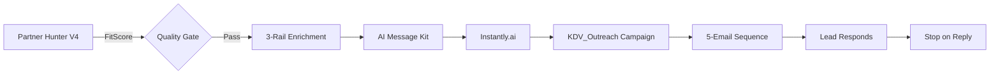

# AI Context Configuration - Instantly.ai V10.1 Integration

**Last Updated:** 2026-02-03  
**Version:** V10.1  
**Owner:** Michel Korpershoek / Antigravity AI

---

## Overview

This document provides AI agents with critical context for working with the Instantly.ai V10.1 sequence configuration in  the Partner Growth Engine v4.0.

---

## 📋 V10.1 Sequence Specification

### Required Configuration
- **Total Emails:** 5
- **Intervals:** Day 0, 3, 6, 9, 14
- **Stop on Reply:** ✅ Enabled
- **Custom Variables:** 7 total
  - `subject_a`, `subject_b` (in subject field)
  - `greeting`, `body`, `cta`, `closing`, `optout` (in body field)

### Progressive Engagement Strategy
1. **Email #1 (Day 0):** AI-personalized introduction (2 A/B variants)
2. **Email #2 (Day 3):** Social proof (existing customers)
3. **Email #3 (Day 6):** Use case reinforcement
4. **Email #4 (Day 9):** Opt-out offer (last reminder)
5. **Email #5 (Day 14):** Breakup email (final send)

---

## 🔑 Campaign Details

### Production Campaign
- **Name:** `KDV_Outreach`
- **ID Secret:** `INSTANTLY_CAMPAIGN_KDV` (Google Secret Manager)
- **Campaign ID:** `fa2c0cdc-1147-4750-a74c-904b4b39e26f`
- **Status:** ✅ V10.1 Compliant (validated Feb 3, 2026)
- **Warmup Start:** Feb 2, 2026
- **Warmup End:** Feb 24, 2026
- **First Sends:** Feb 24, 2026
- **Daily Limit:** 30 leads

### Target Audience
- Kinderopvangorganisaties (KDV)
- Basisscholen  
- Locatie: Nederland
- Contact: Directeuren, Pedagogisch medewerkers

---

## 🔌 API Integration Points

### Campaign Retrieval
```bash
# List campaigns (limited data)
GET https://api.instantly.ai/api/v2/campaigns

# Single campaign (FULL data - use this for validation)
GET https://api.instantly.ai/api/v2/campaigns/{id}
```

**Critical:** Use single campaign endpoint for accurate sequence data. List endpoint returns incomplete `sequences` count only.

### Campaign Update
```bash
PATCH https://api.instantly.ai/api/v2/campaigns/{id}
# Preserves warmup progress, analytics, campaign ID
```

### Lead Addition
```bash
POST https://api.instantly.ai/api/v2/leads/add
```

**Payload:**
```json
{
  "campaign_id": "{CAMPAIGN_ID}",
  "leads": [{
    "email": "contact@example.nl",
    "first_name": "Jan",
    "company_name": "KDV De Kleine Wereld",
    "custom_variables": {
      "subject_a": "AI-generated subject A",
      "subject_b": "AI-generated subject B",
      "greeting": "Beste Jan,",
      "body": "AI-generated body...",
      "cta": "Zal ik 2 voorbeelden sturen?",
      "closing": "Michel",
      "optout": "Afmelden? Stuur een reply."
    }
  }]
}
```

---

## 🛠️ Validation & Scripts

### Validation Script
```bash
npx tsx scripts/validate-instantly-sequence.ts
```

**Checks:**
- ✅ Total emails (5)
- ✅ Intervals (0, 3, 6, 9, 14)  
- ✅ Custom variables (7/7)
- ✅ Stop on Reply enabled

### Update Script
```bash
./scripts/update-kdv-sequence.sh
```

**Uses:**
- `scripts/sequences/kdv_v10_1_sequence.json` - V10.1 payload
- Google Secret Manager for credentials

---

## 🔗 Data Flow



### Integration Points

1. **Phase 1-4:** `partnerHunterV4.ts` (lines 1-350)
   - FitScore calculation
   - 3-Rail enrichment (DataForSEO, Apollo, Tavily)
   - Qualification

2. **Phase 5:** `partnerHunterV4.ts` (lines 351-450)
   - AI Message Kit generation
   - `makeMessageKit()` creates 7 custom variables
   - Bulk lead induction via Instantly API

3. **Instantly Campaign:** `KDV_Outreach`
   - Receives custom variables
   - Distributes across 5-email sequence
   - Stop on Reply enabled

---

## 🚨 Critical Gotchas

### 1. API Response Structures

**List Endpoint** (`/api/v2/campaigns`):
```json
{
  "items": [{
    "sequences": 1  // ⚠️ Count only - NOT full data!
  }]
}
```

**Single Endpoint** (`/api/v2/campaigns/{id}`):
```json
{
  "sequences": [{
    "steps": [{
      "delay": 0,
      "variants": [...]
    }]
  }]
}
```

> **Always use single campaign endpoint for validation.**

### 2. Custom Variable Placement

| Variable | Field | Example |
|----------|-------|---------|
| `subject_a` | `variants[].subject` | `{{subject_a}}` |
| `subject_b` | `variants[].subject` | `{{subject_b}}` |
| `greeting` | `variants[].body` | `{{greeting}}` |
| `body` | `variants[].body` | `{{body}}` |
| `cta` | `variants[].body` | `{{cta}}` |
| `closing` | `variants[].body` | `{{closing}}` |
| `optout` | `variants[].body` | `{{optout}}` |

### 3. A/B Variants

Email #1 has **2 variants** for subject line testing. Validation must check ALL variants:

```typescript
// ❌ Wrong - only checks first variant
const variant1 = email1.variants[0];

// ✅ Correct - checks all variants
email1.variants.forEach(variant => {
    // check variables
});
```

### 4. PATCH vs POST

| Method | Use Case | Preserves |
|--------|----------|-----------|
| `PATCH` | Update existing campaign | ✅ Warmup, analytics, ID |
| `POST` | Create new campaign | ❌ Resets everything |

**Rule:** Always use `PATCH` for updates unless full reset is required.

---

## 📁 File Locations

### Scripts
- `scripts/validate-instantly-sequence.ts` - Validation script
- `scripts/update-kdv-sequence.sh` - Update automation
- `scripts/sequences/kdv_v10_1_sequence.json` - V10.1 payload

### Documentation
- `docs/ADR/0007-instantly-v2-api.md` - API integration ADR
- `docs/API_FINDINGS.md` - API research findings
- `docs/marketing_email_scripts_v1.md` - Email copy

### Source Code
- `functions/src/marketing/partnerHunterV4.ts` - Main workflow
- `functions/src/marketing/skills/makeMessageKit.ts` - AI content generation

---

## 🎯 Success Criteria

A campaign is V10.1 compliant when:
- [x] 5 emails total
- [x] Intervals: 0, 3, 6, 9, 14 days
- [x] 7/7 custom variables present
- [x] Stop on Reply enabled
- [x] Email #1 has 2 A/B variants
- [x] Follow-ups reference `{{subject_a}}` in subject

---

## 🔮 Future Enhancements

### Planned
- School campaign (`INSTANTLY_CAMPAIGN_SCHOOL`)
- Pro campaign (`INSTANTLY_CAMPAIGN_PRO`)
- Reply tracking & CRM integration
- UTM tracking for website clicks

### Under Consideration
- Dynamic interval adjustment based on engagement
- Seasonal subject line variants
- Industry-specific follow-up copy

---

## 📚 References

- [ADR 0007: Instantly.ai V2 API](file:///Users/michelkorpershoek/Downloads/bedtijdavonturen-next-tailwind-scaffold/docs/ADR/0007-instantly-v2-api.md)
- [V10.1 Compliance Walkthrough](file:///Users/michelkorpershoek/.gemini/antigravity/brain/4f041715-1b0f-479e-ad57-d0114b8bf6ed/v10_1_compliance_walkthrough.md)
- [Partner Hunter V4 Source](file:///Users/michelkorpershoek/Downloads/bedtijdavonturen-next-tailwind-scaffold/functions/src/marketing/partnerHunterV4.ts)
- [Instantly.ai API Docs](https://developer.instantly.ai/)

---

**For AI Agents:**
- When debugging Instantly campaigns, ALWAYS use `/api/v2/campaigns/{id}` endpoint
- When validating sequences, check ALL variants in Email #1
- When updating campaigns, use PATCH to preserve warmup
- When generating message kits, ensure all 7 variables are populated
- When troubleshooting, run `npx tsx scripts/validate-instantly-sequence.ts`
